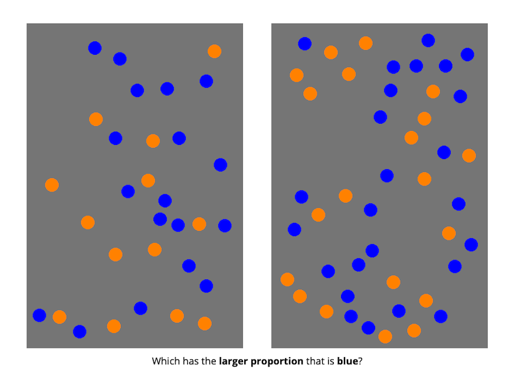

```{r setup, include = FALSE}
library("papaja")
library(tidyverse)
library(ggplot2)
knitr::opts_chunk$set(echo = FALSE,
                      warning = FALSE,
                      tidy = FALSE,
                      knitr::opts_chunk$set(echo = FALSE,root.dir = '~/GitHub/ADV-Topics-2---DSR-w-R/WeeklyAssignments/Assignment 11'),
                      message = FALSE,
                      fig.align = 'center',
                      out.width = "100%")
options(knitr.table.format = "html")
library(tidyverse)
library(ggplot2)
library(ggdist)
prob_task <- read_csv("Chin_WA11_files/data/MFIndD_probtask.csv")
r_refs("r-references.bib")
```

```{r analysis-preferences}
# Seed for random number generation
set.seed(42)
knitr::opts_chunk$set(cache.extra = knitr::rand_seed)
```

# Introduction
Comparing proportions is sometimes very hard! But, even infants seem to be able to do it a little bit. The purpose of this science project was to better understand how well people compare proportions when the proportions are presented in different formats. The purpose of this class assignment is to take the R-code and plots we’ve been generating over the last several weeks and put it all together into one poster format.

# Research Objectives: 
1.Does average performance vary across format type?
2.Does average performance vary across numerator congruency status?
3.Does numerator congruency vary across format type?(ie., is there an interaction)

## Participants
```{r numparts}
num <- 99

```
 A total of `r num ` adults participated in the study. 

## Methods
First participants were introduced to a story about a magic ball and that the outcome(ie., blue or orange) depended on the proportions. They were then asked to compare the proportions of different images.

In other words, participants were shown two images of the same kind at the same time and asked to decided which had a higher proportion of the shape (or dots) colored in blue.

```{r img1}


```
Conditions There were four different conditions that changed what kinds of images the participants saw:

- divided blobs: blur and orange were entirely separate
- integrated blob: one blob, divided to be part blue and part orange
- separated dots: blue and orange dots were on opposite sides of the image
- integrated dots: blue and orange dots were intermixed.

```{r img2}
knitr::include_graphics("img11/Probtask_formats.png")

```


## Results 


## Data analysis
We used `r cite_r("r-references.bib")` for all our analyses.


# Discussion


\newpage

# References
use r_refs( file = "references.bib")

::: {#refs custom-style="Bibliography"}
:::
